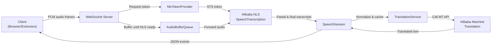

# EchoTranslateService

For documentation in Chinese, see [README.zh.md](README.zh.md).

EchoTranslateService is a TypeScript backend that bridges incoming WebSocket audio streams to Alibaba Cloud NLS speech recognition and machine translation services. The service mirrors the behaviour of the original JavaScript server while focusing on readability, maintainability, and observability.

## Architecture Overview



1. Clients open a WebSocket connection and stream 16 kHz PCM audio frames.
2. `SpeechSession` obtains a short-lived NLS token, then starts an Alibaba NLS transcription session.
3. Incoming audio is temporarily buffered until NLS reports readiness, preventing cold-start loss.
4. Partial transcripts are emitted immediately; finalized text is normalized, optionally cached, and translated.
5. Translated subtitles (and raw recognition text) are pushed back to the client as JSON messages (`changed`, `end`, `completed`, etc.).

## WebSocket Responses

Every server-to-client frame is UTF-8 JSON with the following envelope:

```json
{
  "type": "changed",
  "data": { /* event-specific payload */ }
}
```

| `type` value | `data` payload (shape & notable fields) |
| ------------ | --------------------------------------- |
| `started`    | `{ "message": string }` – emitted once the NLS session is active. |
| `changed`    | `{ "source": string, "result": string, "detectedLanguage": string, "isTranslated": boolean, "latencyMs"?: number }` – incremental transcript updates; `result` is translated text when `isTranslated` is true. |
| `end` / `completed` | Same shape as `changed`; sent when a sentence is finalised. |
| `closed`     | `{ "message": string }` – acknowledgement that the session ended normally. |
| `error` / `failed` | `{ "message": string, "details"?: string }` – unrecoverable errors; clients should close and retry. |

Binary frames from the client should contain 16 kHz PCM audio; all textual responses originate from the server using the schema above.

## Prerequisites

- Node.js >= 18
- npm >= 9
- Alibaba Cloud account with NLS and Machine Translation enabled

## Setup

1. Install dependencies:

   ```bash
   npm install
   ```
2. Copy the example environment file and populate your credentials:

   ```bash
   cp .env.example .env
   ```

   Required variables:- `ALI_ACCESS_KEY_ID`

   - `ALI_ACCESS_KEY_SECRET`
   - `ALI_NLS_APP_KEY`

## Available Scripts

- `npm run dev` – Start the server in watch mode with `ts-node-dev`.
- `npm run build` – Compile TypeScript into `dist/`.
- `npm run start` – Run the compiled JavaScript from `dist/`.
- `npm run lint` – Lint the source files with ESLint.

## Development Notes

- Logs are categorised (startup, websocket, speech, translation) to simplify tracing.
- Speech recognition tokens are cached and refreshed automatically.
- Incoming audio is buffered (configurable) until the NLS session is ready, preventing data loss during initialisation.
- Partial transcripts are pushed immediately so the UI can display raw speech text while translation is still running.
- The service auto-detects the source language (Japanese, Chinese, Korean, English) before sending text to the translation API.

## Latency tuning knobs

| Variable                                | Default | Effect                                                                       |
| --------------------------------------- | ------- | ---------------------------------------------------------------------------- |
| `RECOGNITION_BUFFER_MAX_CHUNKS`       | 16      | Maximum audio frames buffered before NLS is ready                            |
| `RECOGNITION_MAX_START_SILENCE_MS`    | 2000    | Silence tolerated (ms) before speech is considered started                   |
| `RECOGNITION_MAX_END_SILENCE_MS`      | 200     | Silence tolerated (ms) before speech is considered finished                  |
| `RECOGNITION_ENABLE_VOICE_DETECTION`  | false   | Enable/disable server-side voice activity detection                          |
| `RECOGNITION_MIN_CHANGED_DELTA`       | 4       | Minimum character delta between `changed` events to re-trigger translation |
| `RECOGNITION_SEND_SOURCE_IMMEDIATELY` | true    | Whether raw recognition text is pushed before translation completes          |

## Deployment

1. Build the project: `npm run build`
2. Ensure `.env` is present with production credentials.
3. Launch the server: `npm run start`

The WebSocket server listens on `SERVER_PORT` (default `3000`).
