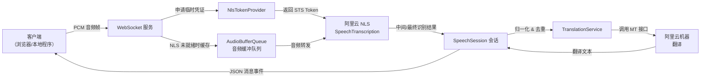

# EchoTranslateService

EchoTranslateService 是一个基于 TypeScript 的实时字幕后端服务，负责将 WebSocket 音频流接入阿里云语音识别与机器翻译，并将字幕结果实时推送给客户端。

## 技术方案



1. 客户端通过 WebSocket 推送 16 kHz PCM 音频帧。
2. `SpeechSession` 获取短期 NLS Token 并启动阿里云语音识别会话。
3. NLS 建链前到达的音频被缓存在 `AudioBufferQueue` 中，待服务就绪后一次性送入识别。
4. 识别结果先推送原文，随后进行文本归一化、缓存控制，再调用机器翻译获取目标语言字幕。
5. 服务端将 `changed`、`end`、`completed` 等事件以 JSON 格式回传客户端，实现实时字幕与翻译。

## 功能特性

- WebSocket 接入：接收浏览器扩展或本地客户端的 PCM 音频块。
- 语音识别：对接阿里云 NLS（SpeechTranscription）获取中间与完整识别结果。
- 自动语言检测：支持日语、中文、韩语、英文优先级检测，默认回退 `auto`。
- 机器翻译：调用阿里云通用翻译服务，输出目标语言字幕。
- 低延迟体验：识别中优先推送原始文本，翻译完成后再补发译文，字幕几乎实时出现。
- 日志与指标：结构化日志、会话级指标，便于定位问题。

## 快速开始

1. 安装依赖：
   ```bash
   npm install
   ```
2. 配置环境变量：
   ```bash
   cp .env.example .env
   ```
   必填项：
   - `ALI_ACCESS_KEY_ID`
   - `ALI_ACCESS_KEY_SECRET`
   - `ALI_NLS_APP_KEY`

3. 开发模式运行：
   ```bash
   npm run dev
   ```
   或编译并运行：
   ```bash
   npm run build
   npm start
   ```

服务默认监听 `SERVER_PORT`（`.env` 可配置，默认 3000），客户端需以二进制方式发送音频流。

## WebSocket 消息格式

服务端发送的每一帧都是 UTF-8 JSON，统一外层结构如下：

```json
{
  "type": "changed",
  "data": { /* 具体负载 */ }
}
```

常见事件类型与 `data` 负载：

| `type` | `data` 字段说明 |
| ------ | --------------- |
| `started` | `{ "message": string }` – 阿里云识别会话已建立，可开始投送音频。 |
| `changed` | `{ "source": string, "result": string, "detectedLanguage": string, "isTranslated": boolean, "latencyMs"?: number }` – 增量识别事件；`result` 为译文（`isTranslated=true`）或原文。 |
| `end` / `completed` | 与 `changed` 相同，表示一句话已终结，字幕可落地。 |
| `closed` | `{ "message": string }` – 会话正常结束。 |
| `error` / `failed` | `{ "message": string, "details"?: string }` – 无法恢复的错误，客户端需自行重连。 |

示例：

```json
{
  "type": "changed",
  "data": {
    "result": "こんにちは",
    "source": "こんにちは",
    "detectedLanguage": "ja",
    "isTranslated": true,
    "latencyMs": 180
  }
}
```

### 延迟调优参数

| 环境变量 | 默认值 | 作用 |
| -------- | ------ | ---- |
| `RECOGNITION_BUFFER_MAX_CHUNKS` | 16 | NLS 建链前最多缓存的音频块数 |
| `RECOGNITION_MAX_START_SILENCE_MS` | 2000 | 判定开口前允许的静音时长（毫秒） |
| `RECOGNITION_MAX_END_SILENCE_MS` | 200 | 判定句尾的静音阈值，越小越快出结果 |
| `RECOGNITION_ENABLE_VOICE_DETECTION` | false | 是否启用 NLS 内置语音检测，可选 |
| `RECOGNITION_MIN_CHANGED_DELTA` | 4 | `changed` 事件在原文本基础长度至少增加多少字符才触发翻译 |
| `RECOGNITION_SEND_SOURCE_IMMEDIATELY` | true | 是否先推原文再补译文 |

## 目录结构

```text
src/
  clients/        阿里云 SDK 客户端封装
  core/           可复用的基础积木（缓冲队列、消息、指标）
  services/       会话与翻译业务逻辑
  utils/          工具方法（日志、语言检测）
  config.ts       环境变量解析
```

更多架构说明参考 `docs/architecture.md`。

## 常见问题

- **NLS 启动报错**：检查密钥、AppKey 是否生效，或确认账号是否开通 NLS 服务。
- **没有翻译结果**：确认目标语言配置是否正确，观察日志中的 `translation` 分类。
- **音频前几帧丢失**：系统会在 NLS 未 ready 时先缓冲，确保不要超过默认 16 个包（可通过环境变量调节）。

## 授权协议

MIT License。
