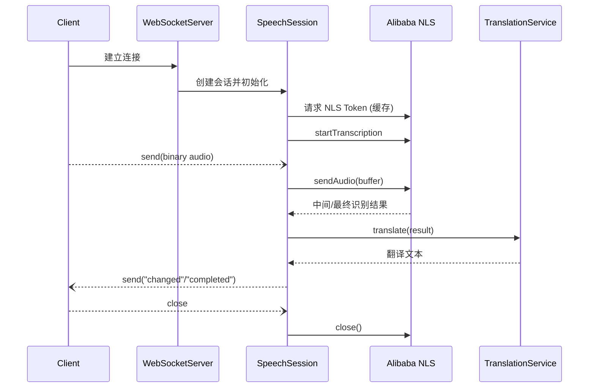

# Video Translate Service 技术方案

## 系统目标

- 接收来自浏览器扩展或其他客户端的实时音频（二进制 WebSocket 数据流）。
- 通过阿里云 NLS 进行语音识别，获得中间结果和完整识别文本。
- 结合检测到的源语言，调用阿里云机器翻译服务，产出目标语言字幕。
- 将识别/翻译进度通过 WebSocket 推送给客户端，并提供观察性日志以便排障。

## 模块拆分

```text
┌───────────────────────┐
│        WebSocket      │◀───────┐ 客户端连接
│        Server         │        │
└──────────┬────────────┘        │
           │                     │
           ▼                     │
┌───────────────────────┐        │
│     SpeechSession     │        │
│  ├─ AudioBufferQueue  │        │
│  ├─ SessionMetrics    │        │
│  ├─ Message Helper    │        │
└──────────┬────────────┘        │
           │识别音频             │
           ▼                     │
┌───────────────────────┐        │
│   Alibaba NLS SDK     │        │
└──────────┬────────────┘        │
           │文本结果             │
           ▼                     │
┌───────────────────────┐        │
│  TranslationService   │        │
│  └─ LanguageDetector  │        │
└──────────┬────────────┘        │
           │翻译文本             │
           ▼                     │
┌───────────────────────┐        │
│  Message Dispatcher   │────────┘ WebSocket 推送
└───────────────────────┘
```

## 核心数据流



## 输入 / 输出

| 接口 | 输入 | 输出 |
| ---- | ---- | ---- |
| WebSocket `message` | PCM 音频二进制块（默认 16kHz、16bit） | 无（服务端只接收） |
| WebSocket 服务器 | `started` / `changed` / `end` / `completed` / `closed` / `error` JSON 消息 | 与前端协定的统一格式 |
| NLS SDK | `start` 参数（编码、静音阈值等） | 识别结果 JSON 字符串 |
| 翻译 SDK | `TranslateGeneralRequest` | 翻译后的文本 |

输出 JSON 消息示例（翻译完成后）：
```json
{
  "type": "changed",
  "data": {
    "result": "你好",
    "source": "こんにちは",
    "detectedLanguage": "ja",
    "isTranslated": true,
    "isFinal": false,
    "latencyMs": 320
  }
}
```

## 配置与扩展点

- 所有阿里云密钥、端口、日志等级通过 `.env` 管理。
- `AudioBufferQueue` 限制缓冲大小（默认 16，可通过 `RECOGNITION_BUFFER_MAX_CHUNKS` 调整）。
- `TranslationService` 暴露了 `defaultSourceLanguage`、`targetLanguage` 等参数，可支持多语言翻译策略。
- 日志分级通过 `LOG_LEVEL` 控制，便于线上排障。
- 识别参数（静音阈值、是否推送原文等）通过 `RECOGNITION_*` 环境变量细粒度调优。

## 复用性设计

- `AudioBufferQueue`：独立缓存模块，可复用在其他流式任务中。
- `SessionMetrics`：标准计数器封装，用于服务端指标上报。
- `sendJsonMessage`：统一消息封装，避免重复拼接 JSON。
- `TranslationService` / `LanguageDetector`：对外暴露明确接口，后续可替换为其他翻译引擎。

## 错误处理策略

1. NLS Token 失效：`NlsTokenProvider` 自动刷新，并记录日志。
2. 音频转发失败：发送 `error` 消息给客户端，同时记录警告。
3. 翻译失败：回退到原始识别文本，保证字幕不中断。
4. SDK 异常：日志中输出 `connectionId`，便于追踪具体会话。

## 性能考量

- 使用缓存 Token，避免每次发送音频都请求。
- 缓冲队列确保 NLS 建立前不会丢失音频包，同时支持削减缓存长度以降低首包延迟。
- `changed` 事件先推原文，再异步翻译并去重，减少等待译文的主观延迟。
- 通过 `SessionMetrics` 增加可观察性，可在未来接入监控或 Prometheus 指标。

## 后续演进

- 支持多客户端并发统计（暴露 REST 状态接口）。
- 增加熔断/重试机制，防止翻译接口短时失败。
- 引入 WebSocket 心跳监测，及时释放闲置连接。
